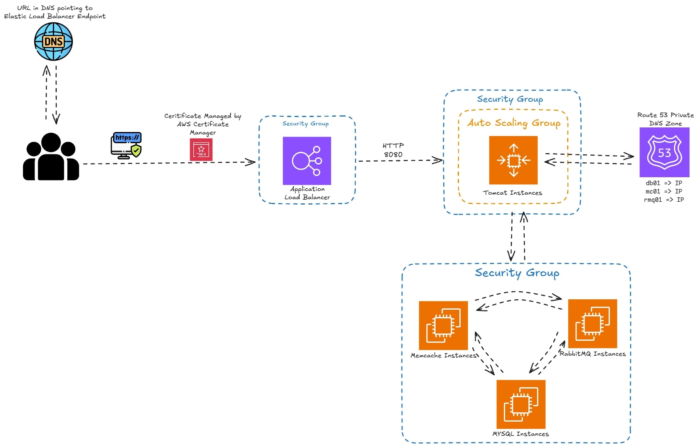

## 📘 Description


This project demonstrates a full **Lift-and-Shift migration strategy** for a complex, multi-tier application stack from a local Vagrant-based environment to a scalable, production-grade infrastructure on **Amazon Web Services (AWS)**.

By replicating and modernising the vProfile stack in the cloud, I implemented core DevOps and cloud engineering concepts, including:

- 🖥️ **EC2-based compute layers** for Tomcat, MySQL, RabbitMQ, and Memcached  
- 🔁 **Elastic Load Balancer (HTTPS + ACM)** for secure traffic routing  
- 📈 **Auto Scaling Groups** to handle dynamic workloads  
- 📦 **S3** for artifact storage and retrieval  
- 📡 **Route 53 Private DNS** for backend service discovery  
- 🔐 **IAM roles and security groups** for access control  
- 🚀 **Infrastructure-as-Code and automation** using user data scripts

## How to Run
1. Clone the repo
```git
git clone <repo_url>
```
2. Go to the terraform directory
```bash
cd Lift and Shift: Migrating a Multi-Tier Web App to AWS/terraform/envs/dev
```
3. Add your Terraform variables to a `terraform.tfvars` file
4. Set up your AWS Credentials with AWS CLI
5. Apply the Terraform script
```bash
terraform init
terraform plan
terraform apply
```
6. Set up the Ansible variables with the outputs from Terraform
```bash
terraform output -json > ../../../ansible/terraform_outputs.json
```
7. Apply your Ansible playbook in the Ansible directory to provision the infrastructure created by Terraform
```bash
ansible-playbook -i inventory.ini playbook.yml
```
8. When you're done, you can run `terraform destroy` to get rid of all the infrastructure and generated configs from terraform.
