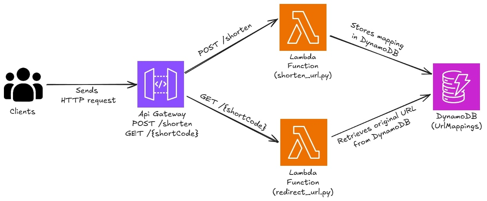

## 📘 Description


This project provisions a **serverless URL shortener** on **Amazon Web Services (AWS)** using **Terraform**. It demonstrates how to build a scalable, cost-effective link shortening service using **Lambda**, **API Gateway**, and **DynamoDB**, all managed through Infrastructure-as-Code.

By implementing this project, I practiced key DevOps and cloud engineering concepts, including:

- **🧠 AWS Lambda** for serverless compute logic (shorten and redirect functions)
- **🌐 API Gateway** for exposing HTTP endpoints
- **🗃️ DynamoDB** for persistent storage of URL mappings
- **🔐 IAM roles and policies** for secure access control
- **🚀 Terraform** for declarative infrastructure provisioning

The result is a fully functional, API-driven URL shortener that can be extended with analytics, custom domains, and frontend integration.

---

## ⚙️ Architecture
- `POST /shorten` route to create short URLs
- `GET /{shortCode}` route to redirect to original URLs
- Two Lambda functions:
  - `shorten_url.py` → stores original URL and returns short code
  - `redirect_url.py` → looks up short code and redirects
- DynamoDB table (`UrlMappings`) with TTL and click tracking
- API Gateway HTTP API with dynamic routing
- IAM roles with scoped permissions for Lambda and DynamoDB

---

## 🛠️ How to Run

1. Clone the repo
```bash
git clone <repo_url>
```

2. Navigate to the Terraform directory
```bash
cd url-shortener
```

3. Add your Terraform variables to a `terraform.tfvars` file
```hcl
environment_variables = {
  TABLE_NAME = "UrlMappings"
  BASE_URL   = "https://<your-api-id>.execute-api.<region>.amazonaws.com"
}
```

4. Set up your AWS credentials using AWS CLI
```bash
aws configure
```

5. Apply the Terraform configuration
```bash
terraform init
terraform plan
terraform apply
```

6. Test the API
```bash
curl -X POST https://<api-url>/shorten \
  -H "Content-Type: application/json" \
  -d '{"url": "https://google.com"}'
```

7. Visit the shortened URL
```bash
curl -i https://<api-url>/<shortCode>
```

8. Tear down the infrastructure (when done)
```bash
terraform destroy
```

---

## 📊 Outputs
After applying, Terraform will display:
- `api_url` → The base URL of your API Gateway
- `dynamodb_table_name` → The name of your URL mapping table
- Lambda function ARNs and IAM role details
