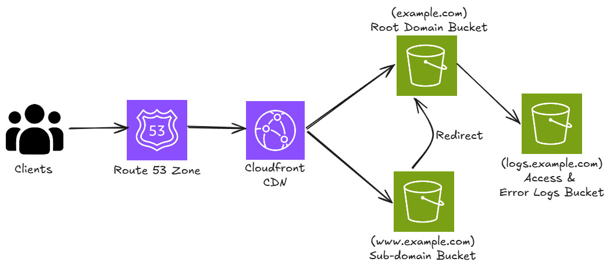

## 📘 Description


This project provisions a static website hosting solution on **Amazon Web Services (AWS)** using **Terraform**. It demonstrates how to serve a custom domain via **Amazon S3** and **Route 53**, with logging and access policies managed through **IAM**.

By implementing this project, I practiced key DevOps and cloud engineering concepts, including:

- **📦 Amazon S3** for hosting static website content (HTML, CSS, JS)
- **🌍 Route 53** for DNS management and custom domain mapping
- **🔐 IAM policies** for secure bucket access and logging
- **📝 S3 Logging** to a dedicated logging bucket
- **🚀 Infrastructure-as-Code** with Terraform modules (storage, networking, IAM)

The result is a cost‑effective, highly available static website hosted entirely on AWS.

##⚙️ Architecture
- Root domain bucket (example.com) configured for static website hosting
- Subdomain bucket (www.example.com) redirecting traffic to the root domain
- Logging bucket to capture access logs
- Bucket policies to allow public read access (or restricted access if using CloudFront)
- Route 53 hosted zone with alias records pointing to the S3 website endpoints

## How to Run
1. Clone the repo
```git
git clone <repo_url>
```
2. Go to the terraform directory
```bash
cd Hosting a static website on Amazon S3
```
3. Add your Terraform variables to a `terraform.tfvars` file
4. Set up your AWS Credentials with AWS CLI
5. Apply the Terraform script
```bash
terraform init
terraform plan
terraform apply
```
6. Upload website content Terraform already provisions index.html and 404.html from the ./site folder. Add more files as needed and re‑apply.

7. Access your website Once DNS propagates, visit:

```Code
http://example.com
http://www.example.com
```

8. Tear down the infrastructure (when done)
```bash
terraform destroy
```

## 📊 Outputs
After applying, Terraform will display:
- `s3-endpoint` → The S3 website endpoint
- Route 53 record details for root and subdomain
